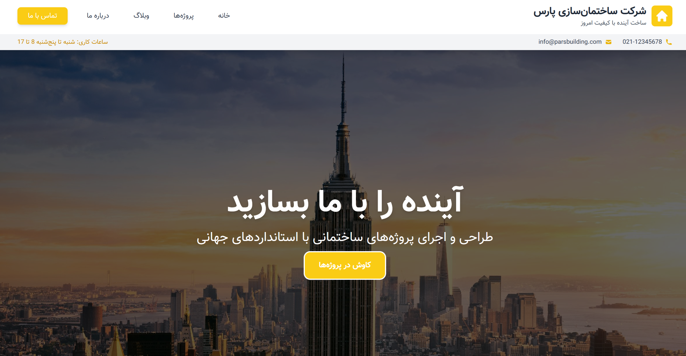

# Company Intro Website


## 📄 Project Description

This is a Django-based website for introducing a construction company. It features three main sections: Home for company overview, Blog for articles and news, and Projects for showcasing completed works. The site is fully responsive for mobile, tablet, and desktop, with RTL support for Persian language. It uses SQLite as the default database, Tailwind CSS for styling, and no Docker or DRF. No user registration or accounts are required. Admin panel allows publishing blogs and projects.

Key features:
- **Home Page** 🏠: Hero banner, services, selected projects, testimonials, team, and contact form.
- **Blog Section** 📝: List of published posts with search (future), detail view with content.
- **Projects Section** 🏗️: List of published projects with category filters, search by name, detail view showing categories.
- Responsive design ensures optimal viewing on all devices.





## 🚀 Setup and Installation

Follow these steps to set up the project locally.

### Prerequisites
- Python 3.10+
- pip
- virtualenv (recommended)

### Installation Steps (Bash Script)

```bash
# Clone the repository
git clone https://github.com/MojtabaFotohi/company-intro.git
cd company_intro

# Create and activate virtual environment
python -m venv venv
source venv/bin/activate  # On Windows: venv\Scripts\activate

# Install dependencies
pip install -r requirements.txt

# Apply migrations
python manage.py makemigrations
python manage.py migrate

# Create superuser for admin panel
python manage.py createsuperuser

# Collect static files (if needed)
python manage.py collectstatic --noinput

# Run the server
python manage.py runserver
```

Access the site at `http://127.0.0.1:8000/`. Admin panel at `/admin`.

### Directory Structure
- `company_intro/` : Main project settings, URLs.
- `apps/home/` : Home page views, templates.
- `apps/blog/` : Blog models, views, templates.
- `apps/projects/` : Projects models, views, templates with filters and search.
- `static/` : CSS, JS, images.
- `templates/` : Base templates, includes.
- `media/` : Uploaded images for blogs/projects.

## 🛠️ Usage

- **Admin Panel**: Log in to `/admin` to create categories, publish blogs/projects.
- **Blog**: Add posts with title, excerpt, content, image; set `is_published=True` to display.
- **Projects**: Add projects with title, description, image, categories; publish to show in list with filters/search.
- **Frontend**: HTML/CSS/JS with Tailwind; RTL via `dir="rtl"`.

## 📝 Notes
- Database: SQLite (default).
- No external APIs or auth.
- For production: Use PostgreSQL, configure STATIC/MEDIA properly.

For issues, open a pull request or contact the developer.
